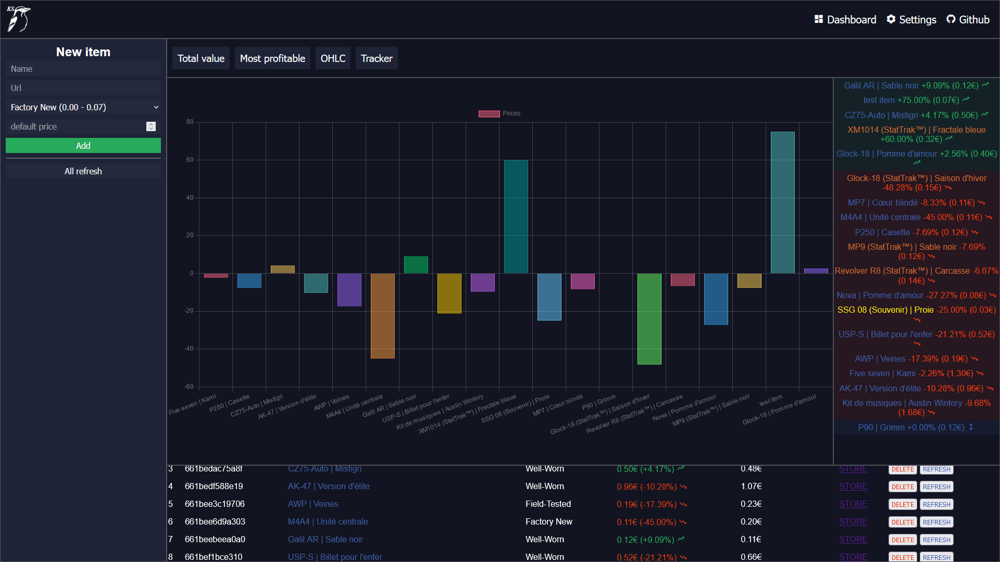

# Steam Store Tracker (SST)
SST is a small, portable site running on PHP. It allows you to add items to a list and track prices on the steam market.

The site works without a database, everything is stored locally. Multiple accounts are possible.

***for the moment, only euro works.***

Problem discovered:
Due to bad servers on the steam side, when retrieving the price of certain weapons, steam may give no value. This will return an empty value, causing PHP errors. (I'll fix it one day.)